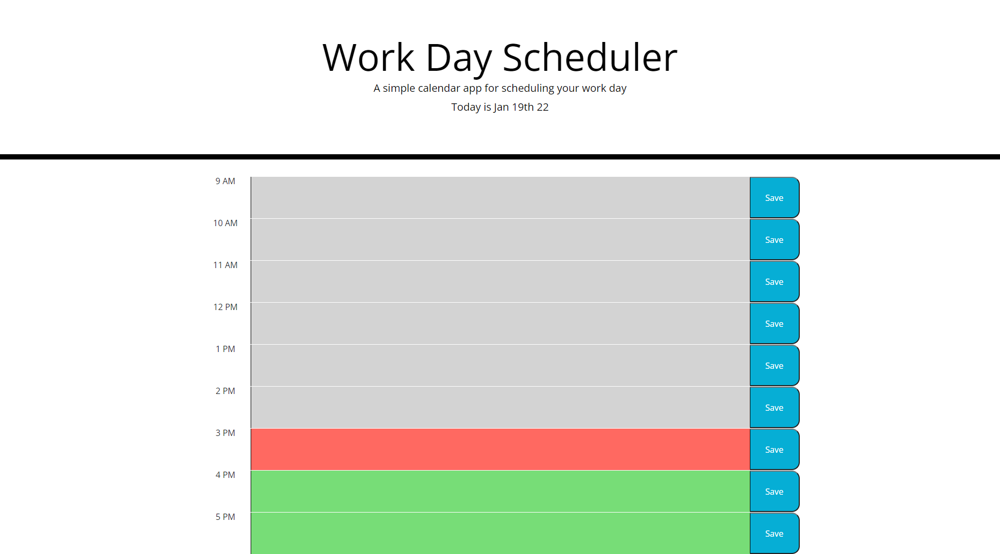

# Work Day Scheduler

## Purpose
A scheduling site that manages your tasks for the day. It tells you what tasks you have coming up, when the time has passed and what you should currently be working on. 

The site saves tasks to local storage.
## Built With
* HTML
* CSS
* JavaScript

## Website
https://reidschroder.github.io/work-day-scheduler/

## Preview

## Contribution
Reid Schroder
